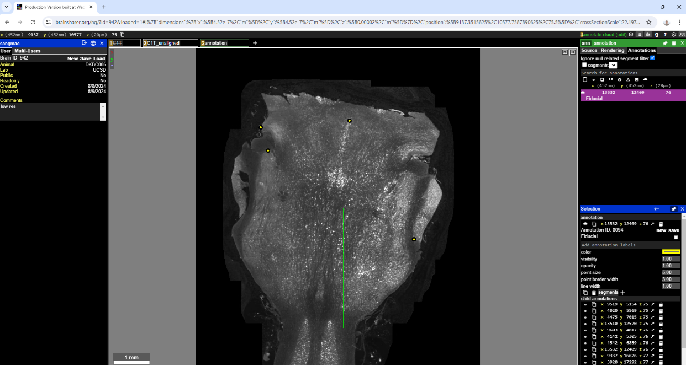

Brain section alignment with fiducials
~~~~~~~~~~~~~~~~~~~~~~~~~~~~~~~~~~~~~~

**Background**
As part of data ingestion pipeline onto brainsharer.org, sections must be aligned.  
The general pipeline steps allow for automated alignment post-masking.  Unfortunately some sections may 
still be out of alignment and require fiducials to properly align specific sections to the rest of the image stack.

After the pipeline has completed (Neuroglancer-compatible image stack created and visible from 
brainsharer.org), user should identify which sections are out of alignment, create fiducials and re-rerun alignment.  
This document describes these steps.

**Process and example**

* Create the non aligned layer in the pipeline: `python src/pipeline/scripts/create_pipeline.py --task realign --animal {ANIMAL_ID}`

* In a browser, open up the Neuroglancer view with URL ID provided.

* Add another layer with the '+' icon next to the 'C1T' layer.  This will be the layer where you will add the fiducials. To do this, in the 'new layer' precomputed source text box on the right, type: `https://imageserv.dk.ucsd.edu/data/{ANIMAL_ID}/C1T_unaligned/`

* Open up the upper left quadrant. You don't need the other quadrants for this process as the virtual projections are not ready. You may need to adjust
  the brightness and contrast to see the image better. See the 'Adjusting colors' page for more information.

*   Identify which section(s) are not properly aligned through Neuroglancer interface.  The z value is the section number.

*   Navigate to non-aligned section (in figure below this is section 75).

*   Create a new annotation layer (just click CTRL and  the "+" icon next to the "C1T_unaligned" layer. That creates a new annotation layer. 

*   Click the 'Annotations' tab on the top far right, then  click the 'Annotate cloud’ icon on the far right (in red box)

.. image:: ../_static/realignment.2.png

*   Pick 2 or 3 points on unaligned section and save with a Fiducial label.

**Adding fiducial label**

*   Go to the lower right panel and type 'Fiducial' in the text box that says 'Add annotation labels'. A search result will pop up. 

*   Select the 'Fiducial' selection

**Save current state**

*   Click the 'new' (lower-case ‘n’) icon in lower-right corner of screen (see figure below) 

*   Note: These are NOT same new/save buttons used for saving entire state!  Those have upper-case letters.

*   N.B. If you add more points, make sure to click the 'save' button on the bottom far right.

*   Repeat cloud annotations for all non-aligned sections (same number of points)

**Re-align image stack**

After fiducials have been created you will need to re-align the stack based on these fiducials.

*   The file deletion and the neuroglancer processes are occur during the realignment process.

**Re-run alignment & Neuroglancer pipeline steps**

1.  Login into one of the linux workstations

2.  Navigate to /data/pipeline/ (contains all scripts)
        ``cd /data/pipeline``

3.  Active the python virtual enviroment
        ``source /usr/local/share/pipeline/bin/activate``

4.  Run  align step [for channel 1, downsampled]
        ``python src/pipeline/scripts/create_pipeline.py --task realign --animal {ANIMAL_ID}``

5.  Check the new data set in Neuroglancer
